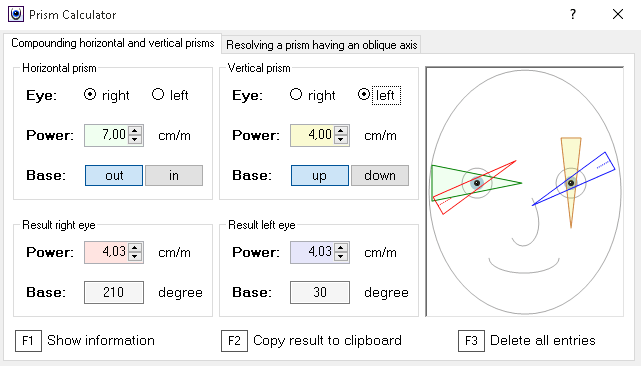

# PrismCalc

If binocular double vision is caused by horizontal and vertical deviation, it is usual to measure the horizontal and vertical part of the deviation with horizontal and vertical compensation prism.

By contrast, it makes sense to prescribe prisms with oblique axis, because a lower total strength is required then.

The program calculates the strength of the resulting prism with oblique base axis. Also recalculations and different distributions between the two eyes are possible. All user inputs and calculations are visualized.

